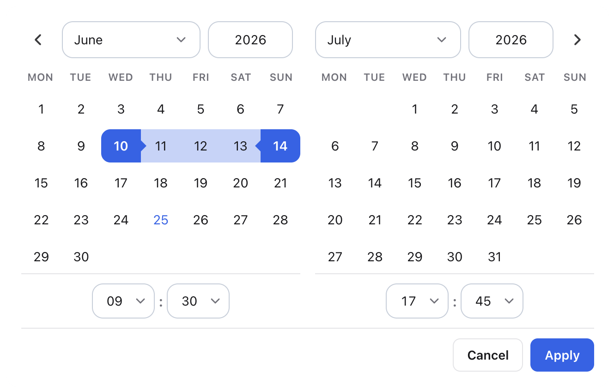
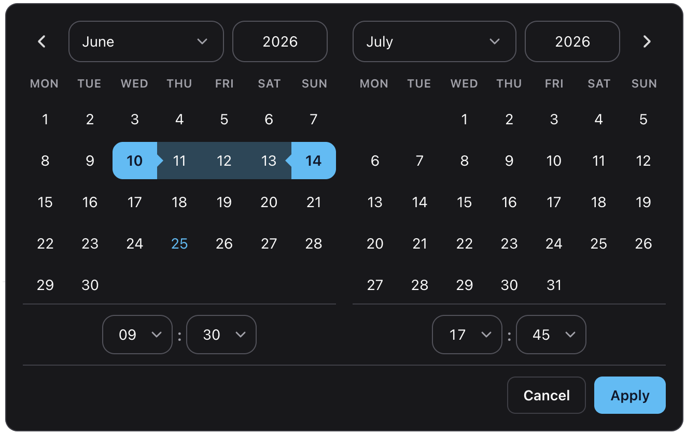

<p align="center">
  <picture>
    <source srcset="./assets/logo-dark.png" media="(prefers-color-scheme: dark)" />
    
  </picture>
</p>

# DateFlow

<p align="center">
  
  
  
  
  
  
  
</p>

<p align="center">
  
  
</p>

<p align="center">
  <strong>Modern TypeScript date picker for web applications.</strong>
</p>

<table align="center">
  <tr>
    <td align="right">✓</td>
    <td align="left">Single dates and ranges</td>
    <td width="32"></td>
    <td align="right">✓</td>
    <td align="left">Time selection</td>
    <td width="32"></td>
    <td align="right">✓</td>
    <td align="left">Framework agnostic</td>
  </tr>
  <tr>
    <td align="right">✓</td>
    <td align="left">Accessible</td>
    <td></td>
    <td align="right">✓</td>
    <td align="left">Tree-shakeable locales</td>
    <td></td>
    <td align="right">✓</td>
    <td align="left">Mobile friendly</td>
  </tr>
</table>

<p align="center">
  <a href="https://janpalicka.github.io/DateFlow/"><strong>Live documentation & examples →</strong></a>
</p>

## Install

```bash
npm install dateflow date-fns
```

`date-fns` is a peer dependency — install it in your app.

## Why DateFlow

DateFlow was built for modern TypeScript applications.

- No framework lock-in
- Strong TypeScript support
- Accessible keyboard navigation
- Range selection built in
- Tree-shakeable locales
- ~20 kB gzip JavaScript
- ~3.4 kB gzip CSS

## Quick start

```html
<input id="trip" type="text" placeholder="Pick a date" />
```

```ts
import { dateFlow } from "dateflow";
import "dateflow/style.css";

const input = document.querySelector<HTMLInputElement>("#trip")!;

const picker = dateFlow(input, {
  value: new Date(),
  popover: true, // default — opens below the input
});

// picker.destroy() when removing the field from the DOM
```

`dateFlow` also accepts a `#id` selector or a `.class` selector (class returns one instance per matched input).

## Features

- Single-date and range selection
- Optional time pickers (12h/24h, seconds, minute steps)
- Floating popover or inline layout
- Built-in locales (`en`, `de`, `cs`, `fr`) with partial overrides
- Min/max bounds, allowlists, blocklists, week numbers
- Typed programmatic API (`setDate`, `setRange`, `open`, `close`, …)
- Accessible markup and keyboard support

## Date ranges

```ts
dateFlow(input, {
  mode: "range",
  range: { start: new Date(2026, 5, 1), end: new Date(2026, 5, 14) },
  onRangeChange: (range) => console.log(range),
});
```

Range mode shows **Apply** / **Cancel** actions. Use `onRangeChange` for committed range updates.

## Locales

Locales are a separate entry so you only bundle what you import:

```ts
import { dateFlow } from "dateflow";
import { de } from "dateflow/locales";
import "dateflow/style.css";

dateFlow(input, { locale: de });
```

Built-in locales: `en`, `de`, `cs`, `fr`. Pass a partial `CalendarLocale` object to override individual strings.

## Options

| Option                                | Description                                                                                |
| ------------------------------------- | ------------------------------------------------------------------------------------------ |
| `mode`                                | `"single"` (default) or `"range"`                                                          |
| `value`                               | Selected `Date` in single mode                                                             |
| `range`                               | `{ start, end }` in range mode                                                             |
| `onChange` / `onRangeChange`          | Called when the value is committed                                                         |
| `minDate` / `maxDate`                 | Selectable bounds                                                                          |
| `disabledDates` / `enabledDatesOnly`  | Block or allow specific dates (array or predicate)                                         |
| `disabledDatesStrikeThrough`          | Strike through disabled day numbers                                                        |
| `showTime`                            | Enable hour/minute (and optional second) selectors                                         |
| `use12HourTime`                       | 12-hour clock with AM/PM when `showTime` is on                                             |
| `showSeconds`                         | Show seconds selector                                                                      |
| `minuteStep`                          | Minute dropdown step (default `5`)                                                         |
| `outputFormat`                        | [date-fns `format`](https://date-fns.org/docs/format) pattern for the visible value        |
| `rangeOutputSeparator`                | Between start and end in range output (default `"—"`)                                      |
| `showWeekNumbers`                     | ISO week numbers in the first column                                                       |
| `allowInput`                          | Type dates directly into the value field                                                   |
| `hideOnSingleSelect`                  | Close popover after picking a day in single mode (default `true`)                          |
| `inline`                              | Render calendar in-page instead of a popover                                               |
| `popover`                             | Open on focus, position with Floating UI, close on outside click / Escape (default `true`) |
| `appendTo`                            | Popover mount target (default `document.body`)                                             |
| `className` / `theme`                 | Extra class / `data-cal-theme` on the calendar root                                        |
| `showResetButton` / `resetInputLabel` | Header reset control                                                                       |
| `ariaLabel`                           | Accessible name for the calendar region                                                    |
| `locale`                              | Locale from `dateflow/locales` or a custom partial object                                  |

See the [documentation](https://janpalicka.github.io/DateFlow/) for full examples: constraints, time selection, theming, and more.

## Instance API

Each call to `dateFlow` returns a `CalendarPickerInstance`:

| Method / property                            | Description                                          |
| -------------------------------------------- | ---------------------------------------------------- |
| `selectedDates` / `currentYear`              | Read-only view state                                 |
| `getValue()` / `setValue(date)`              | Single-mode value                                    |
| `getRange()` / `setRange(range)`             | Range-mode value                                     |
| `setDate(dates, format?, silent?)`           | Set one or more dates (strings use date-fns parsing) |
| `changeMonth(months, relative?)`             | Navigate the visible month                           |
| `clear()`                                    | Clear selection (same as reset)                      |
| `setOptions(partial)`                        | Merge options and re-render                          |
| `open()` / `close()`                         | Show or hide the panel                               |
| `getInputElement()` / `getCalendarElement()` | DOM references                                       |
| `destroy()`                                  | Tear down listeners and popover                      |

## Browser support

DateFlow targets modern evergreen browsers. The library ships as ESM and uses current DOM APIs (`replaceChildren`, optional chaining, and similar).

| Browser       | Minimum version |
| ------------- | --------------- |
| Chrome / Edge | 111+            |
| Firefox       | 113+            |
| Safari / iOS  | 16.2+           |

These versions cover full styling, including CSS `color-mix()` used for themes and range highlights. The picker may still work on slightly older browsers (for example Safari 14+), but colors and transparency can look incorrect.

Internet Explorer is not supported. Use a bundler (Vite, Webpack, Rollup, etc.) in your app — DateFlow does not ship a legacy UMD build.

## Development

```bash
pnpm install
pnpm dev            # docs showcase (local)
pnpm build          # library → dist/
pnpm build:docs     # static docs site → dist-docs/
pnpm test           # unit tests
pnpm lint           # oxlint + type-aware checks
pnpm check          # format, lint, and types
```

CI runs lint, tests, and build on every push. Docs deploy to GitHub Pages on push to `main`.

## License

MIT
